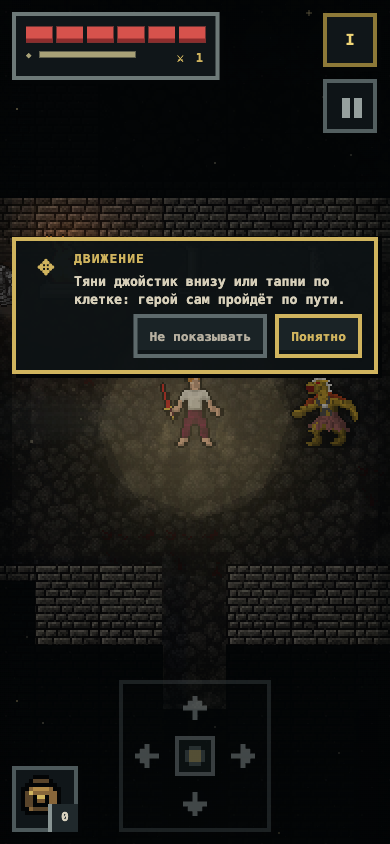

# DNG Codex

Pixel roguelike RPG for phones, played with one finger: the hero fights on
their own — you decide where to go, what to pick up, what to wear, what to
learn and when to retreat.

**Play in the browser:** https://johninwork.github.io/dng-codex/

## What's inside

- 18 floors in three chapters with a guardian at the end of each, a city on
  the surface with a king, shops, a tavern and a house to buy.
- 27 skills in three ranks, six schools of magic, 140+ pieces of equipment —
  all visible on the hero.
- Hunger, sleep, hunting and cooking; traps, mimics and locked chests.
- Russian and English, works offline as a PWA.

## About this repository

This repository contains only the **published build** of the game, deployed
automatically to GitHub Pages. The source code is private.

Stack: vanilla JavaScript (ES modules), Vite, Three.js; art from the
Dungeon Crawl Stone Soup tiles (CC0) and other licensed packs — see
`THIRD-PARTY-NOTICES.txt`.

Feedback and bug reports: [Issues](https://github.com/JohnInWork/dng-codex/issues).

## License

© Ivan Kuznetsov. All rights reserved — see [LICENSE](LICENSE). Third-party
assets keep their own licenses, listed in `THIRD-PARTY-NOTICES.txt`.
